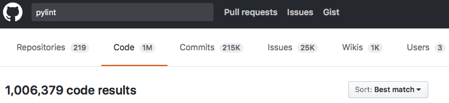
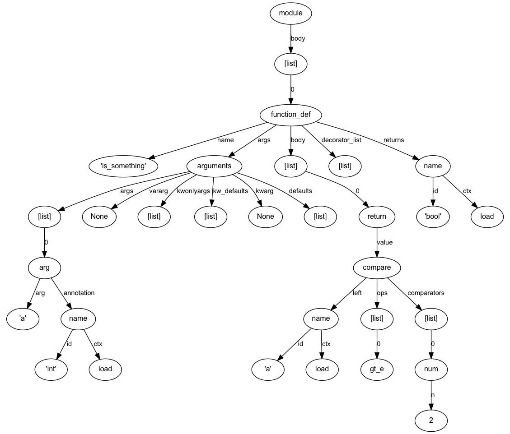
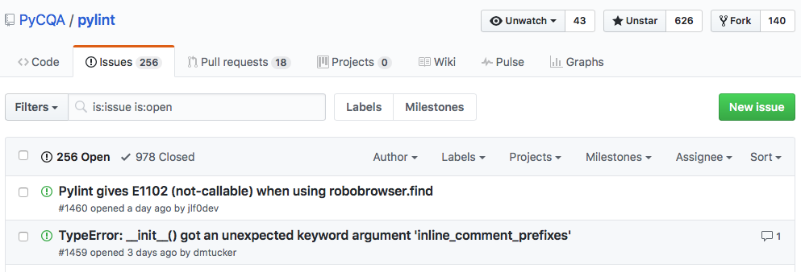

# Deep dive into Pylint
## Łukasz Rogalski

---

## Agenda
1. Static analysis
2. Pylint as static analysis tool
3. Checkers
4. Inference engine
5. Known issues
6. Alternatives
7. Summary
8. Q&A

---

## Static analysis
### Definition
> Static program analysis is the **analysis** of computer software that is performed **without actually executing programs**. In most cases the analysis is **performed on some version of the source code**, and in the other cases, some form of the object code.  
> The term is usually applied to the analysis performed by an **automated tool**, with human analysis being called program understanding, program comprehension, or code review. Software inspections and software walkthroughs are also used in the latter case.  
[Static program analysis - Wikipedia](https://en.wikipedia.org/wiki/Static_program_analysis)

---

## Pylint as static analysis tool
[PyCQA/pylint: A Python source code analyzer which looks for programming errors, helps enforcing a coding standard and sniffs for some code smells](https://github.com/PyCQA/pylint)
- Dated back as far as 2001 (Python 2.2), originally authored by Sylvain Thénault at Logilab
- First commit in Git: [forget the past. · PyCQA/pylint@4becf6f](https://github.com/PyCQA/pylint/commit/4becf6f9e596b45401680c4947e2d92c953d5e08) (committed on 26 Apr 2006)
- I wasn’t able to find old SVN repo :( 

---

### Quite popular:
[Search · pylint · GitHub](https://github.com/search?q=pylint&type=Code)

### How to install:
```bash
$ pip3 install pylint
```
### How to run:
```bash
$ pylint my_package
```

---

## What it can do?

---

#### Catch actual errors (ex1_errors.py)
```python
# pylint: disable=R,C
import sys


def mispellings():
    my_str = "Hello, PyGDA!"
    print(my_st)  # misspelled variable
    sys.stout.write(my_str)  # misspelled attribute


def bad_except_order():
    try:
        return func()
    except ValueError:
        pass
    except UnicodeError:
        # never reached, superclass is caught first
        pass
```

###### Output
```shell
$ pylint ex1_errors.py 
No config file found, using default configuration
************* Module ex1_errors
E:  8,10: Undefined variable 'my_st' (undefined-variable)
E:  9, 4: Module 'sys' has no 'stout' member; maybe 'stdout'? (no-member)
E: 17,11: Bad except clauses order (ValueError is an ancestor class of UnicodeError) (bad-except-order)
```

---

#### Warn about common pitfalls
```python
# pylint: disable=R,C
def mutable_default_arg(sequence=[]):
    pass


class Class:
    def __init__(self, x):
        self.x = x


class Subclass(Class):
    def __init__(self, x):
        self.y = x + 1
```

###### Output

```shell
$ pylint ex2_warnings.py 
No config file found, using default configuration
************* Module ex2_warnings
W:  2, 0: Dangerous default value [] as argument (dangerous-default-value)
W:  2,24: Unused argument 'sequence' (unused-argument)
W: 12, 4: __init__ method from base class 'Class' is not called (super-init-not-called)
```

---

#### Enforce code style (e.g. naming convention, docstrings, code complexity)
```python
def whyDontuseCamelCase(argument):
    return argument > 2


def reallyComplexFunction(arg1, arg2, arg3, arg4, arg5):
    """Fairly complicated function that returns arbitrary integer"""
    some_value = whyDontuseCamelCase(arg1)
    if some_value:
        return some_value
    if arg1:
        if arg2 and arg3:
            return 1
        elif arg2 and not arg3:
            return 2
        return 3
    elif arg4 and arg5:
        return 4
    return 5
```

---

###### Code style: output
```shell
$ pylint --load-plugins=pylint.extensions.mccabe --max-complexity=5 ex3_convention_refactor.py
No config file found, using default configuration
************* Module ex3_convention_refactor
C:  1, 0: Missing module docstring (missing-docstring)
R:  5, 0: 'reallyComplexFunction' is too complex. The McCabe rating is 6 (too-complex)
C:  1, 0: Invalid function name "whyDontuseCamelCase" (invalid-name)
C:  1, 0: Missing function docstring (missing-docstring)
C:  5, 0: Invalid function name "reallyComplexFunction" (invalid-name)
```

---

#### Using Pylint - summary
- Fully configurable, all checks may be explicitly disabled / enabled (globally for project, locally for module, code block or individual statement) 
- Some of checks (e.g. naming convention) are parametrized and may be adjusted to accommodate for your project rules

#### Is this all?
- I'm not here to tell about _how to use_ Pylint.
- Let's dive into implementation!

---

## Checkers

---

## Checker
Checker implements code verification logic. 

- pluggable architecture (new checker is a `BaseChecker` subclass, registered in linter before analysis start)
- exact API depends on type of checks checker performs


### Two groups of checkers:
- token-based checkers
- AST-based checkers

---

### Token-based checkers
#### Tokens
> A Python program is read by a parser. Input to the parser is a stream of tokens, generated by the lexical analyzer.

See [lexical analysis](https://docs.python.org/3.6/reference/lexical_analysis.html) for details.

`tokenize` module in standard library allows to generate tokens based on module source.

---

###### simple_module.py:
```python
def is_something(a: int) -> bool:
    return a >= 2
```
###### run_tokenize.py:
```python
import tokenize

module_name = "simple_module.py"
with open(module_name) as fh:
    for token in tokenize.generate_tokens(fh.readline):
        print(token)
```

---

###### Output

```python
TokenInfo(type=1 (NAME), string='def', start=(1, 0), end=(1, 3), line='def is_something(a: int) -> bool:\n')
TokenInfo(type=1 (NAME), string='is_something', start=(1, 4), end=(1, 16), line='def is_something(a: int) -> bool:\n')
TokenInfo(type=53 (OP), string='(', start=(1, 16), end=(1, 17), line='def is_something(a: int) -> bool:\n')
TokenInfo(type=1 (NAME), string='a', start=(1, 17), end=(1, 18), line='def is_something(a: int) -> bool:\n')
TokenInfo(type=53 (OP), string=':', start=(1, 18), end=(1, 19), line='def is_something(a: int) -> bool:\n')
TokenInfo(type=1 (NAME), string='int', start=(1, 20), end=(1, 23), line='def is_something(a: int) -> bool:\n')
TokenInfo(type=53 (OP), string=')', start=(1, 23), end=(1, 24), line='def is_something(a: int) -> bool:\n')
TokenInfo(type=53 (OP), string='->', start=(1, 25), end=(1, 27), line='def is_something(a: int) -> bool:\n')
TokenInfo(type=1 (NAME), string='bool', start=(1, 28), end=(1, 32), line='def is_something(a: int) -> bool:\n')
TokenInfo(type=53 (OP), string=':', start=(1, 32), end=(1, 33), line='def is_something(a: int) -> bool:\n')
TokenInfo(type=4 (NEWLINE), string='\n', start=(1, 33), end=(1, 34), line='def is_something(a: int) -> bool:\n')
TokenInfo(type=5 (INDENT), string='    ', start=(2, 0), end=(2, 4), line='    return a >= 2\n')
TokenInfo(type=1 (NAME), string='return', start=(2, 4), end=(2, 10), line='    return a >= 2\n')
TokenInfo(type=1 (NAME), string='a', start=(2, 11), end=(2, 12), line='    return a >= 2\n')
TokenInfo(type=53 (OP), string='>=', start=(2, 13), end=(2, 15), line='    return a >= 2\n')
TokenInfo(type=2 (NUMBER), string='2', start=(2, 16), end=(2, 17), line='    return a >= 2\n')
TokenInfo(type=4 (NEWLINE), string='\n', start=(2, 17), end=(2, 18), line='    return a >= 2\n')
TokenInfo(type=6 (DEDENT), string='', start=(3, 0), end=(3, 0), line='')
TokenInfo(type=0 (ENDMARKER), string='', start=(3, 0), end=(3, 0), line='')
```

---

###### Sample line from output:
```
TokenInfo(type=53 (OP), string='>=', start=(2, 13), 
          end=(2, 15), line='    return a >= 2\n')
```
Each token has some some basic data associated with themselves:
- token type
- string value
- row and column indices for beginning and end of token
- actual line that token comes from

---

#### Token Checker API
```python
from pylint.checkers import BaseChecker

class BaseTokenChecker(BaseChecker):
    """Base class for checkers that want to have access to the token stream."""

    def process_tokens(self, tokens):
        """Should be overridden by subclasses."""
        raise NotImplementedError()
```
#### Typical checks
- whitespace violations
- mixed indentation (tabs/spaces)
- etc.

Essentially, those checks rely on information which are missing from abstract syntax tree.

---

### AST-based checkers
#### Abstract syntax tree
> In computer science, an abstract syntax tree (AST), or just syntax tree, is a tree representation of the abstract syntactic structure of source code written in a programming language. Each node of the tree denotes a construct occurring in the source code. The syntax is "abstract" in not representing every detail appearing in the real syntax.   
[Abstract syntax tree - Wikipedia](https://en.wikipedia.org/wiki/Abstract_syntax_tree)

---

#### Python ASTs
`ast` module in standard library allows to generate syntax tree based on module source.
###### simple_module.py
```python
def is_something(a: int) -> bool:
    return a >= 2
```
###### run_ast.py
```python
import ast

module_name = "simple_module.py"
with open(module_name) as fh:
    ast_root = ast.parse(fh.read(), filename=module_name)
```

---


<sub>https://github.com/quantifiedcode/python-ast-visualizer</sub>

---

#### AST-based checker
- is fed with AST tree 
- walks over inputted tree (*visitor* pattern)
- invokes `visit_{nodeclass}` method
- those method acts accordingly based on visited nodes

---

#### Check example
###### bad_super_call.py
```python
class MyClass(object):
    def __init__(self):
        pass  # some implementation

class DerivedClass1(MyClass):
    def __init__(self):
        # call superclass __init__ (?)
        super(type(self), self).__init__()
        self.x = 1
       
class DerivedClass2(MyClass):
    def __init__(self):
        # call superclass __init__ (?)
        super(self.__class__, self).__init__()
        self.x = 2
```

- Invalid when `DerivedClass1` or `DerivedClass2` is subclassed!
- Infinite recursion on instantiation of subclass

---

#### Let's implement a checker for this case!
1. When `FunctionDef` node is visited (and node is a method)
2. Find all `Call` nodes that belong to this method
3. If called node is a `Name` node and it's value is `"super"`
4. Check first argument of called function:
   * If first argument is `Call` node and called node is a `Name` with value `"type"` and it's single argument is first argument of method (`self`) or 
   * If first argument is an `Attribute` access, where accessed member is `__class__` and object is first argument of method (`self`)
5. Emit a message

[Code essentially does the same operation as pseudocode above](https://github.com/PyCQA/pylint/blob/master/pylint/checkers/newstyle.py#L103) - you have to trust me on this one.

---

#### Obviously not *that* easy
1. `FunctionDef` AST node is shared between methods and functions - how to differentiate between them?
2. We don't want to walk through FunctionDef body and collect `Call` nodes blindly - sometimes they belong to another scope (e.g. another function defined in method)
3. We implicitly assumed that `super` and `type` names are bound to original built-in functions. What if they are not?

---

## Inference engine

---

### Problem statement
- both token-based and AST-based checkers knows only about structure of the source code (token-based: how the code was written, AST-based: how the code was parsed)
- it’s desirable to have actual knowledge about execution (*without* running the code)

### Solution
- astroid (AST on steroids) - [PyCQA/astroid: A common base representation of python source code for pylint and other projects](https://github.com/PyCQA/astroid)

---

### `astroid`
> It provides a compatible representation which comes from the `_ast` module. It **rebuilds the tree** generated by the builtin `_ast` module by recursively walking down the AST and building an extended AST. The new node classes have **additional methods and attributes for different usages**. They include some support for **static inference** and **local name scopes**. Furthermore, `astroid` builds partial trees by **inspecting living objects**. 

---

### `astroid` basic functionality
#### Parent / child relationship of nodes
###### parent_children_demo.py
```python
SOME_GLOBAL = 1  #@


def func(x):  #@
    y = x ** 2
    return y  #@
```

---

###### run_parent_children.py
```python
import astroid

with open('parent_children_demo.py') as fh:
    nodes = astroid.extract_node(fh.read())
    assign_node, function_node, return_node = nodes

print(assign_node)
# Assign(targets=[<AssignName.SOME_GLOBAL l.1 at 0x0>],
#      value=<Const.int l.1 at 0x0>)
print(assign_node.parent)
# Module(name='',
#        doc=None,
#        file='<?>',
#        path='<?>',
#        package=False,
#        pure_python=True,
#        future_imports=set(),
#        body=[<Assign l.1 at 0x0>, <FunctionDef.func l.4 at 0x0>])
```

---
 
```python
print(function_node)
# FunctionDef.func(name='func',
#                  doc=None,
#                  decorators=None,
#                  args=<Arguments l.4 at 0x0>,
#                  returns=None,
#                  body=[<Assign l.5 at 0x0>, <Return l.6 at 0x0>])
children = list(function_node.get_children())
print(children)
# [<Arguments l.4 at 0x0>, <Assign l.5 at 0x0>, <Return l.6 at 0x0>]
print(return_node in children)
# True
```

---

#### Naming scopes
###### run_naming_scopes.py (1)
```python
import astroid

with open('simple_module.py') as fh:
    module_node = astroid.parse(fh.read())

function_node = module_node.body[0]
print(function_node.lookup('a'))
# (<FunctionDef.is_something l.1 at 0x106c70400>,
#  [<AssignName.a l.1 at 0x106c5a128>])
print(module_node.lookup('is_something'))
# (<Module l.0 at 0x106c70390>, 
#  [<FunctionDef.is_something l.1 at 0x106c70400>])
print(module_node.lookup('bool'))
# (<Module.builtins l.0 at 0x1063abd68>,
#  [<ClassDef.bool l.0 at 0x1068795c0>])
```

---

## Understanding common language constructs

---

#### Method resolution order (MRO)
###### mro_demo.py
```python
class A: pass
class B: pass
class C(A, B): pass
class D(B): pass
class E(D, C): pass
print(E.mro())
```

###### Output
```
[<class '__main__.E'>, <class '__main__.D'>, 
 <class '__main__.C'>, <class '__main__.A'>, 
 <class '__main__.B'>, <class 'object'>]
```


---

###### run_mro_demo.py
```python
import astroid

with open('mro_demo.py') as fh:
    my_module = astroid.parse(fh.read())

e_class = my_module.locals['E'][0]
print(e_class.mro())
```
###### Output
```
[<ClassDef.E l.6 at 0x0>, <ClassDef.D l.5 at 0x0>, 
 <ClassDef.C l.4 at 0x0>, <ClassDef.A l.2 at 0x0>, 
 <ClassDef.B l.3 at 0x0>, <ClassDef.object l.0 at 0x0>]
```

---

### Metaclasses
###### mcs_demo.py
```python
class Meta(type):  #@
    pass

class A:  #@
    pass

class B(metaclass=Meta): #@
    pass
```

###### run_mcs_demo.py
```python
import astroid

with open('mcs_demo.py') as fh:
    nodes = astroid.extract_node(fh.read())

meta_clsdef, a_clsdef, b_clsdef = nodes
assert a_clsdef.metaclass() is None
assert b_clsdef.metaclass() is meta_clsdef
```

---

#### Understanding rest of syntax
It's known that most of Python syntax is sugar over _dunder methods_.
When we can understand MRO and metaclasses of inspected instance, we can easily do look-up of correct dunder method for inference purposes.

- Boolean statements (`and`, `or` and `not`): `__bool__` (Python 3.x) / `__nonzero__` (Python 2.x)
- Binary operations: (`&`, `|`, `%` etc.): `__and__`, `__or__`, `__mod__` etc.
- Indexing: `__getitem__` (including support for slices)
- Context managers: `__enter__`, `__exit__`
- ...

---

###### dunders_demo.py
```python
class A:
    def __init__(self, value):
        self.value = value
    def __add__(self, other):
        return A(self.value + other.value)

a1 = A(3)
a2 = A(5)
a3 = a1 + a2
assert a3.value == 8

class CtxMgr:
    def __enter__(self):
        return self
    def __exit__(self, exc_type, exc_val, exc_tb):
        pass

with CtxMgr() as obj:
    pass
```

---

###### run_dunders_demo.py
```python
import astroid

with open("dunders_demo.py") as fh:
    my_module = astroid.parse(fh.read(),
                              module_name='dunders')

a3_node = my_module.locals['a3'][0]
inferred_node = next(a3_node.infer())
print('a3', inferred_node)

obj_node = my_module.locals['obj'][0]
inferred_node = next(obj_node.infer())
print('obj', inferred_node)
```
###### Output
```
a3: Instance of dunders.A
obj: Instance of dunders.CtxMgr
```

---

#### Slicing
###### slicing_demo.py
```python
sequence = [1, 1, 2, 5, 8, 13]
sequence2 = sequence[::2]
sequence  #@
sequence2  #@
```
###### run_slicing_demo.py
```python
import astroid

with open("slicing_demo.py") as fh:
    seq_node, seq2_node = astroid.extract_node(fh.read())

inferred_seq1 = next(seq_node.infer())
inferred_seq2 = next(seq2_node.infer())
print(inferred_seq1)
print([v.value for v in inferred_seq1.elts])
print(inferred_seq2)
print([v.value for v in inferred_seq2.elts])
```

---

###### Output
```
List.list(ctx=<Context.Load: 1>,
          elts=[ <Const.int l.1 at 0x0>,
            <Const.int l.1 at 0x0>,
            <Const.int l.1 at 0x0>,
            <Const.int l.1 at 0x0>,
            <Const.int l.1 at 0x0>,
            <Const.int l.1 at 0x0>])
[1, 1, 2, 5, 8, 13]
List.list(ctx=None,
          elts=[ <Const.int l.1 at 0x0>,
            <Const.int l.1 at 0x0>,
            <Const.int l.1 at 0x0>])
[1, 2, 8]
```

---

#### Understanding language constructs - summary
- In-depth understanding of Python execution model
- Better understanding means more possibilites for catching code errors

---

### Transforms, `astroid.brain`
- Interpreter core code is implemented in C - no source code to even start reasoning about inference
- Fancy code, even if implemented in Python, is also difficult to infer 
- We use handcrafted set of rules to improve inference engine
- Two ways of doing it:
  - custom inference tips
  - node transforms
- Easy API for registering new transforms:

```python
MANAGER.register_transform(node_class,
                           transform_callable,
                           predicate)
```

---

### Custom inference tips
- _quasi_ node transform - it sets internal attribute on AST node
- this attribute is later used for inferring actual values

```python
def inference_tip(infer_function):
    def transform(node, infer_function=infer_function):
        node._explicit_inference = infer_function
        return node
    return transform
```
- `infer_function` should be a generator of inferred values

---

### Inference tip demo
```python
def infer_bool(node, context=None):
    """Understand bool calls."""
    if len(node.args) > 1:
        # Invalid bool call.
        raise UseInferenceDefault

    if not node.args:
        return nodes.Const(False)

    argument = node.args[0]
    try:
        inferred = next(argument.infer(context=context))
    except InferenceError:
        return util.Uninferable
    if inferred is util.Uninferable:
        return util.Uninferable

    bool_value = inferred.bool_value()
    if bool_value is util.Uninferable:
        return util.Uninferable
    return nodes.Const(bool_value)
```

---

### Node transforms
- mutation of AST, which actually modifies final tree
- handcrafted rules for "tricky" modules (`enum`, `namedtuple`, `six`, `typing` to name a few)
- example: add extra names to module scope (if namespace is populated dynamically)

---

### Inference engine summary
Inference engine is a _gift and the curse_ of Pylint.

- Powerful inference engine means we can catch more problems in code comparing to other tools
- Unfortunately, mistakes during inference causes much higher false positive ratio 

---

## Known Pylint problems

---

### Flow analysis
###### flow_inference.py
```python
def func(arg):
    if not arg:
        return None
    return 2 * arg
    
x = func(3)
x  #@
```
###### run_no_flow_control.py
```python
import astroid

with open('flow_inference.py') as fh:
    node = astroid.extract_node(fh.read())

for value in node.infer():
    print(value)
```

---

###### Output
```
Const.NoneType(value=None)
Const.int(value=6)
```

###### Observations
- We know value passed to function; this value is `3` which is `True` in boolean context, therefore `if` branch is not taken
- Even in this simple example we are still deducing that return value *may possibly* be `None` (even though it's not possible)
- Important when flow control statements are used (conditionals, exceptions, `continue`/`break` on loops etc.)

###### Conclusions
- As of today, Pylint default config would avoid to emit warnings in case of ambiguity
- Workaround, not a solution...
- Needs proper flow control support


---

### Dynamic code constructs
Example: [issue28082: use IntFlag for re constants · python/cpython@deec4d0](https://github.com/python/cpython/commit/deec4d0aea8eb0225c4fe3999815a2cb6c0ad20c?diff=split)
###### Before patch 
```python
# flags
A = ASCII = sre_compile.SRE_FLAG_ASCII # assume ascii "locale"
I = IGNORECASE = sre_compile.SRE_FLAG_IGNORECASE # ignore case
L = LOCALE = sre_compile.SRE_FLAG_LOCALE # assume current 8-bit locale
U = UNICODE = sre_compile.SRE_FLAG_UNICODE # assume unicode "locale"
M = MULTILINE = sre_compile.SRE_FLAG_MULTILINE # make anchors look for newline
S = DOTALL = sre_compile.SRE_FLAG_DOTALL # make dot match newline
X = VERBOSE = sre_compile.SRE_FLAG_VERBOSE # ignore whitespace and comments

# sre extensions (experimental, don't rely on these)
T = TEMPLATE = sre_compile.SRE_FLAG_TEMPLATE # disable backtracking
DEBUG = sre_compile.SRE_FLAG_DEBUG # dump pattern after compilation
```

---

###### After patch 
```python
class Flag(enum.IntFlag):
    ASCII = sre_compile.SRE_FLAG_ASCII # assume ascii "locale"
    IGNORECASE = sre_compile.SRE_FLAG_IGNORECASE # ignore case
    LOCALE = sre_compile.SRE_FLAG_LOCALE # assume current 8-bit locale
    UNICODE = sre_compile.SRE_FLAG_UNICODE # assume unicode "locale"
    MULTILINE = sre_compile.SRE_FLAG_MULTILINE # make anchors look for newline
    DOTALL = sre_compile.SRE_FLAG_DOTALL # make dot match newline
    VERBOSE = sre_compile.SRE_FLAG_VERBOSE # ignore whitespace and comments
    A = ASCII
    I = IGNORECASE
    L = LOCALE
    U = UNICODE
    M = MULTILINE
    S = DOTALL
    X = VERBOSE
    # sre extensions (experimental, don't rely on these)
    TEMPLATE = sre_compile.SRE_FLAG_TEMPLATE # disable backtracking
    T = TEMPLATE
    DEBUG = sre_compile.SRE_FLAG_DEBUG # dump pattern after compilation
globals().update(Flag.__members__) # (!!!)
```

---

## Alternatives

---

### pycodestyle (formerly known as PEP8)
> `pycodestyle` is a tool to check your Python code against some of the style conventions in PEP 8.  

- No-AST policy (as lightweight as possible), checks are based on tokenization and regular expression
- Mostly limited to style-based checks

[PyCQA/pycodestyle: Simple Python style checker in one Python file](https://github.com/PyCQA/pycodestyle)

---

### pyflakes
> A simple program which checks Python source files for errors.  
> Pyflakes analyzes programs and detects various errors. It works by parsing the source file, not importing it, so it is safe to use on modules with side effects. It’s also much faster.  
> Pyflakes is also **faster** than Pylint or Pychecker. This is largely because Pyflakes **only examines the syntax tree of each file individually**. As a consequence, Pyflakes is **more limited** in the types of things it can check.

- Simpler
- With AST-based checks, without inference engine

[PyCQA/pyflakes: A simple program which checks Python source files for errors.](https://github.com/PyCQA/pyflakes)

---

## Summary
- Static analysis: definition and basic principles
- Pylint checkers as a validation performing logic
- Two basic types of checkers: token-based and AST-based
- Tokens and ASTs are two different ways to look at source code
- Token-based checker: looks at code formatting
- AST-based checker: looks at code structure
- Inference engine as a crucial part of analysis
- Other analysis tools and it's comparision to Pylint

---

### We still have a lot of issues unresolved

**Pull requests are welcome!**

---

# Acknowledges (alphabethical order)
- [**Krzysztof Czapla**](https://github.com/kczapla) - slides review, lots of valuable comments

---

# Thanks!
- Slides: https://github.com/rogalski/pygda-pylint-talk
- My LinkedIn: https://www.linkedin.com/in/lukasz-rogalski/

---

# Q&A
